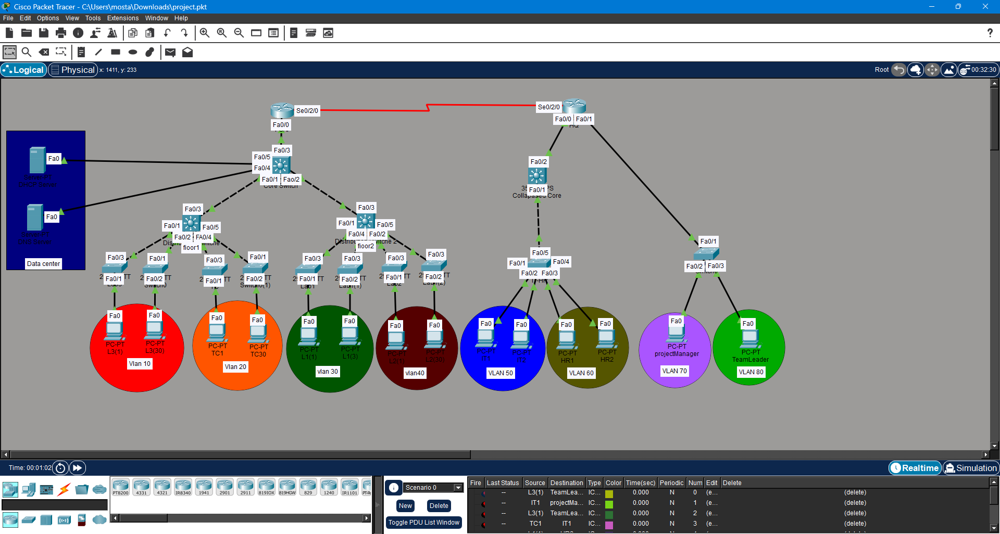

# 🌐 FCAI Enterprise Network Design


---

# 📌 Overview

This project is a complete enterprise network infrastructure design for the Faculty of Computers and Artificial Intelligence (FCAI) and Headquarters (HQ) using Cisco Packet Tracer.

The network was designed using:
- Three-Tier Architecture
- Two-Tier Architecture
- VLAN Segmentation
- Inter-VLAN Routing
- DHCP
- DNS
- Static Routing
- Router-on-a-Stick

---
## Network Topology


# 🏗️ Network Architecture
---
## 🔹 FCAI Branch

FCAI uses a Three-Tier Design:

- Core Layer
- Distribution Layer
- Access Layer

### Floor 1
- LAB3 → VLAN10
- TC → VLAN20

### Floor 2
- LAB1 → VLAN30
- LAB2 → VLAN40

Each lab contains 30 PCs connected through 2 Access Switches.

---

## 🔹 HQ Branch

HQ uses a Two-Tier Design.

### Departments
- IT → VLAN50
- HR → VLAN60
- Project Manager → VLAN70
- Team Leader → VLAN80

---

# 🌍 IP Addressing Scheme

| VLAN | Network |
|---|---|
| VLAN10 | 192.168.10.0/24 |
| VLAN20 | 192.168.20.0/24 |
| VLAN30 | 192.168.30.0/24 |
| VLAN40 | 192.168.40.0/24 |
| VLAN50 | 192.168.50.0/24 |
| VLAN60 | 192.168.60.0/24 |
| VLAN70 | 192.168.70.0/24 |
| VLAN80 | 192.168.80.0/24 |

---

# 🔄 Inter-VLAN Routing

Inter-VLAN communication was implemented using Router-on-a-Stick.

Example:

```bash
interface g0/0.10
encapsulation dot1Q 10
ip address 192.168.10.1 255.255.255.0
```

---

# 📡 DHCP Configuration

## FCAI
A centralized DHCP Server dynamically assigns:
- IP Address
- Subnet Mask
- Default Gateway
- DNS Server

## HQ
The HQ Router acts as a DHCP Server.

---

# 🌐 DNS Configuration

DNS was configured to resolve:

```text
fcai.com → 192.168.10.2
```

---

# 🔗 WAN Connectivity

FCAI and HQ are connected using:
- Serial WAN Link
- Static Routing

Example:

```bash
ip route 192.168.50.0 255.255.255.0 10.0.0.2
```

---

# 🧪 Testing

The network was tested successfully using:

```bash
ping
ipconfig
show vlan brief
show interfaces trunk
show ip interface brief
```

---

# 📂 Project Structure

```text
FCAI-Network-Design/
│
├── packet-tracer/
│   └── fcai-network.pkt
│
├── report/
│   └── report.pdf
│
├── screenshots/
│   ├── topology.png
│   ├── ping-test.png
│   ├── vlan-config.png
│   └── routing-test.png
│
└── README.md
```

---

# 🚀 Skills Demonstrated

- Enterprise Network Design
- VLAN Segmentation
- Inter-VLAN Routing
- DHCP Deployment
- DNS Configuration
- Static Routing
- Cisco Switch Configuration
- Router Configuration
- Troubleshooting

---

# 🛠️ Technologies Used

- Cisco Packet Tracer
- Cisco Routers
- Cisco Switches
- IEEE 802.1Q
- DHCP
- DNS
- Static Routing

---

# 👨‍💻 Author

## Mostafa Mahmoud Refai Metwally

- Cybersecurity Engineering Student
- Faculty of Computers and Artificial Intelligence

---

# ⭐ Future Improvements

Possible future upgrades:
- OSPF Routing
- ACL Security
- IPv6 Support
- EtherChannel
- Network Monitoring
- Redundant Links

---
# 👥 Team Members

| Name                              | Role                                                                             |
| --------------------------------- | -------------------------------------------------------------------------------- |
| [Mostafa Mahmoud Refai Metwally](https://github.com/Ms6fy) | Team Leader • Network Architecture • Inter-VLAN Routing • DHCP • Troubleshooting |
| [Mohamed Orabii](https://github.com/mohamedorabii) |Team Member                                                                    |
| [Youssef Muhammad Hosni](https://github.com/you2662) | Team Member                                                                      |
| Youssef Alaa Jalal                | Team Member                                                                      |
| Mustafa Adel Sayed                | Team Member                                                                      |
| [Mahmoud Ashraf Mahmoud Kamel](https://github.com/mahmoudashraf113)      | Team Member                                                                      |

---

# 📜 License

This project was developed for educational purposes.
